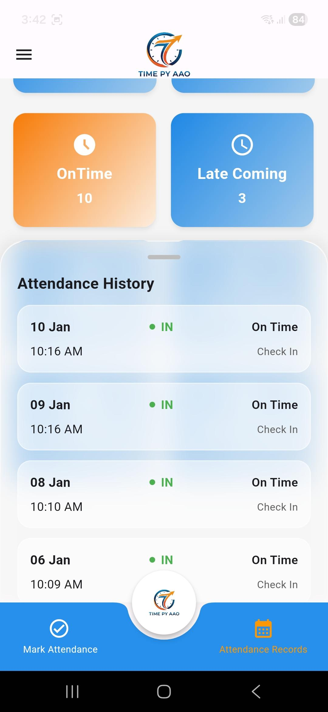
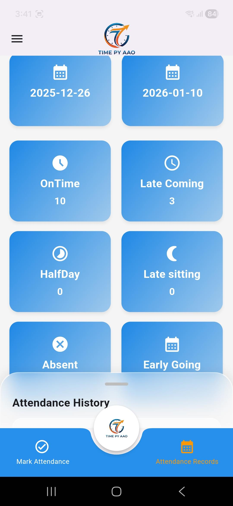
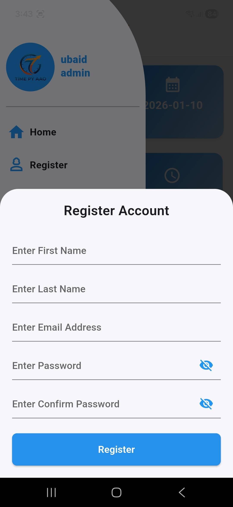
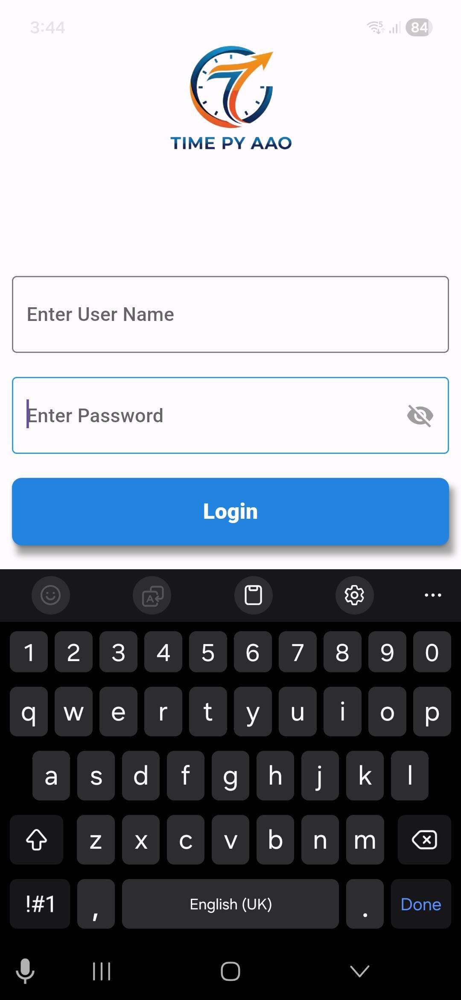

<h3 align="center">App Screenshots</h3>

<table align="center">
  <tr>
    <td align="center">
       
      <b>Attendance History</b>
    </td>
    <td align="center">
       
      <b>Attendance Rules</b>
    </td>
    <td align="center">
       
      <b>Register Screen</b>
    </td>
  </tr>
  <tr>
    <td align="center">
       
      <b>Login Screen</b>
    </td>
    <td align="center">
       
      <b>Check-out</b>
    </td>
    <td align="center">
       
      <b>Check-in</b>
    </td>
  </tr>
</table>