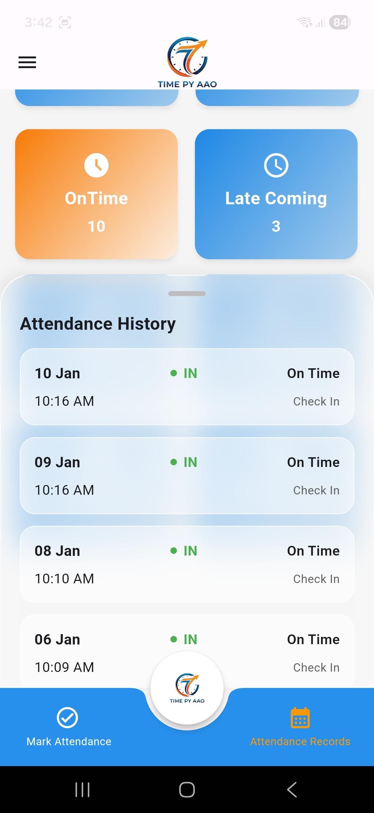
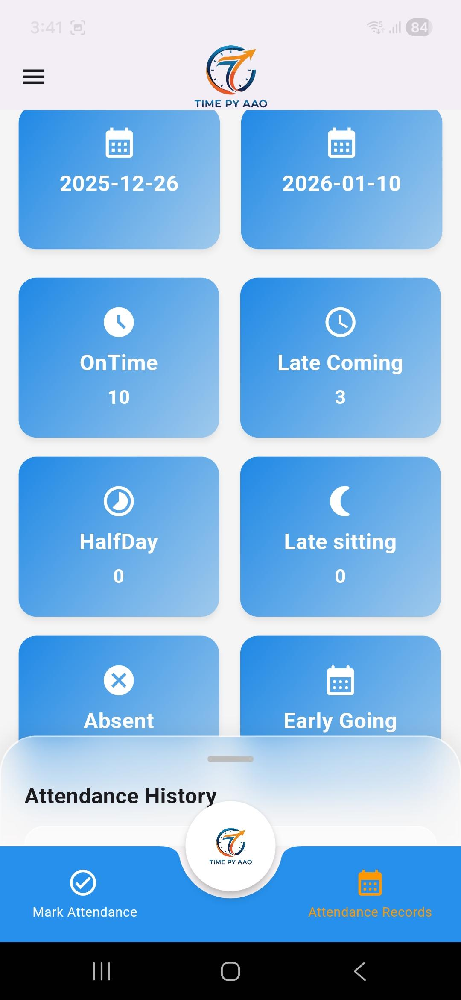
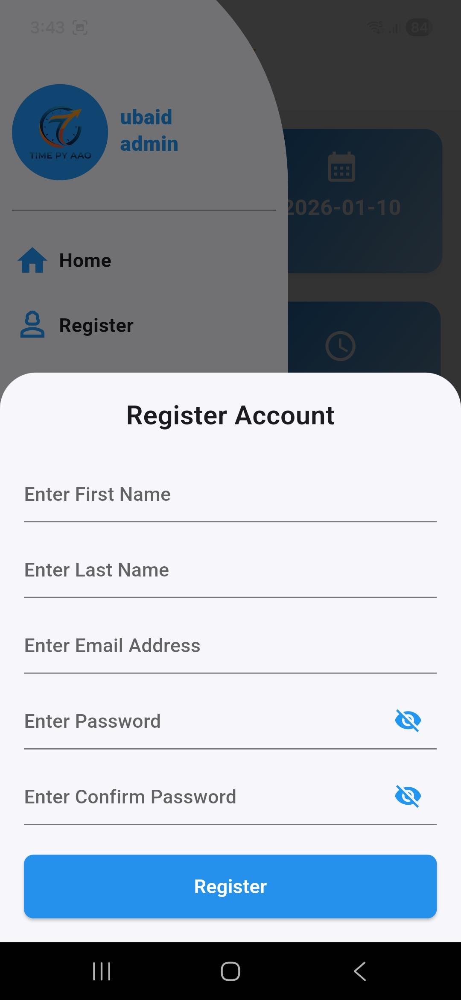
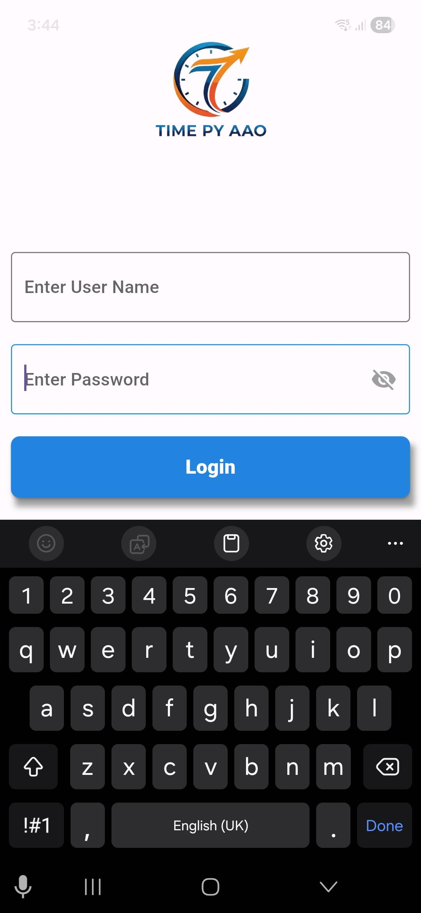

## Attendance App

- An Attendance Flutter application built using Provider + MVVM architecture, featuring secure authentication, attendance tracking, and admin management with a powerful Node.js backend.

### 🚀 Features
#### 🔐 Authentication
- User Login with secure session handling
- Persistent login using Secure Storage & SharedPreferences
### 📍 Attendance Management
- User Check-In / Check-Out
- View attendance history
- Filter attendance by date or custom criteria
### 🌐 Connectivity Handling
- Internet status detection using Connectivity Plus
### 👨‍💼 Admin Panel
- Register new users
- Delete attendance records
- Access all user functionalities with additional privileges
## 🏗 Architecture & Tech Stack
### 📱 Frontend (Flutter)
- Provider (State Management)
- MVVM Architecture
- REST API Integration
- Secure Storage
- SharedPreferences
- Connectivity Plus
### ⚙️ Backend
- Node.js (Express.js)
- MongoDB (Database)

<h3 align="center">App Screenshots</h3>

<table align="center">
  <tr>
    <td align="center">
       
      <b>Attendance History</b>
    </td>
    <td align="center">
       
      <b>Attendance Rules</b>
    </td>
    <td align="center">
       
      <b>Register Screen</b>
    </td>
  </tr>
  <tr>
    <td align="center">
       
      <b>Login Screen</b>
    </td>
    <td align="center">
       
      <b>Check-out</b>
    </td>
    <td align="center">
       
      <b>Check-in</b>
    </td>
  </tr>
</table>
